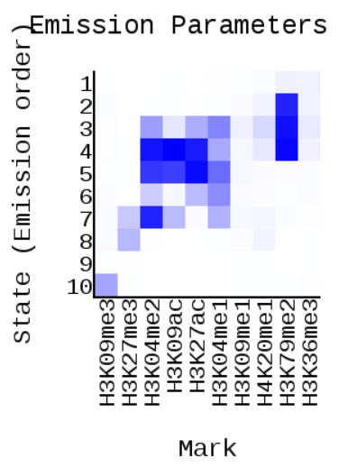

# Ноутбук

https://colab.research.google.com/drive/1WrstPyV3EbcI6A920mdZVtSnbW0ZZHuE?usp=sharing

# Список гистоновых меток и соотв имен файлов

H3K27ac wgEncodeBroadHistoneNhekH3k27acStdAlnRep2.bam 

H3K27me3 wgEncodeBroadHistoneNhekH3k27me3StdAlnRep2.bam 

H3K36me3 wgEncodeBroadHistoneNhekH3k36me3StdAlnRep2.bam 

H3K04me1 wgEncodeBroadHistoneNhekH3k4me1StdAlnRep2.bam 

H3K04me2 wgEncodeBroadHistoneNhekH3k4me2StdAlnRep2.bam

H3K79me2 wgEncodeBroadHistoneNhekH3k79me2AlnRep2.bam 

H3K09ac wgEncodeBroadHistoneNhekH3k9acStdAlnRep2.bam 

H3K09me1 wgEncodeBroadHistoneNhekH3k9me1StdAlnRep2.bam 

H3K09me3 wgEncodeBroadHistoneNhekH3k09me3AlnRep2.bam 

H4K20me1 wgEncodeBroadHistoneNhekH4k20me1StdAlnRep2.bam 

# Картинки из выдачи ChromHMM

# Картинки из UCSC GenomeBrowser

# Эпигенетические типы

1. Open chromatin: наиболее выражен в H3K79me2 и H3K36me3, чаще попадает на участок RefSeqTES
2. Open chromatin: наиболее выражен в H3K79me2, чаще попадает на участок RefSeqGene
3. Open chromatin: наиболее выражен в H3K79me2, чаще попадает на участок RefSeqGene
4. Intron: наиболее выражен в H3K04me2, H3K09ac, H3K27ac и H3K79me2, чаще попадает на участки RefSeqExon и RefSeqTSS2kb
5. Enchancer: наиболее выражен в H3K27ac, чаще попадает на участок RefSeqTSS
6. Active Promoter: наиболее выражен в H3K04me1, чаще попадает на участки RefSeqTES и laminB1lads
7. Weak Promoter: наиболее выражен в H3K04me2, чаще попадает на участки CpGIsland, RefSeqExon и RefSeqTSS
8. Weak Promoter: наиболее выражен в H3K27me3, чаще попадает на участки RefSeqTES и laminB1lads
9. Repressed Heterochromatin: не выражен, чаще попадает на участок laminB1lads
10. Repressed Heterochromatin: наиболее выражен в H3K09me3, чаще попадает на участок laminB1lads
